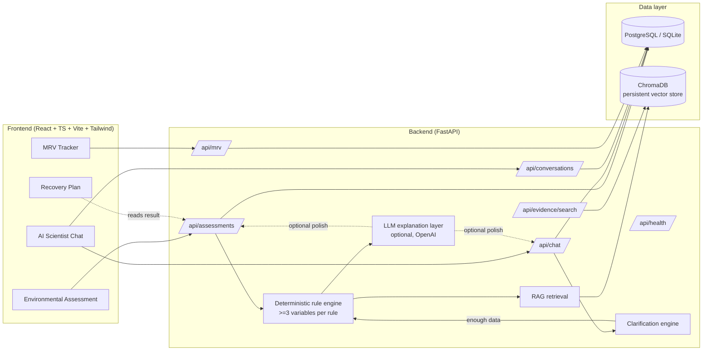
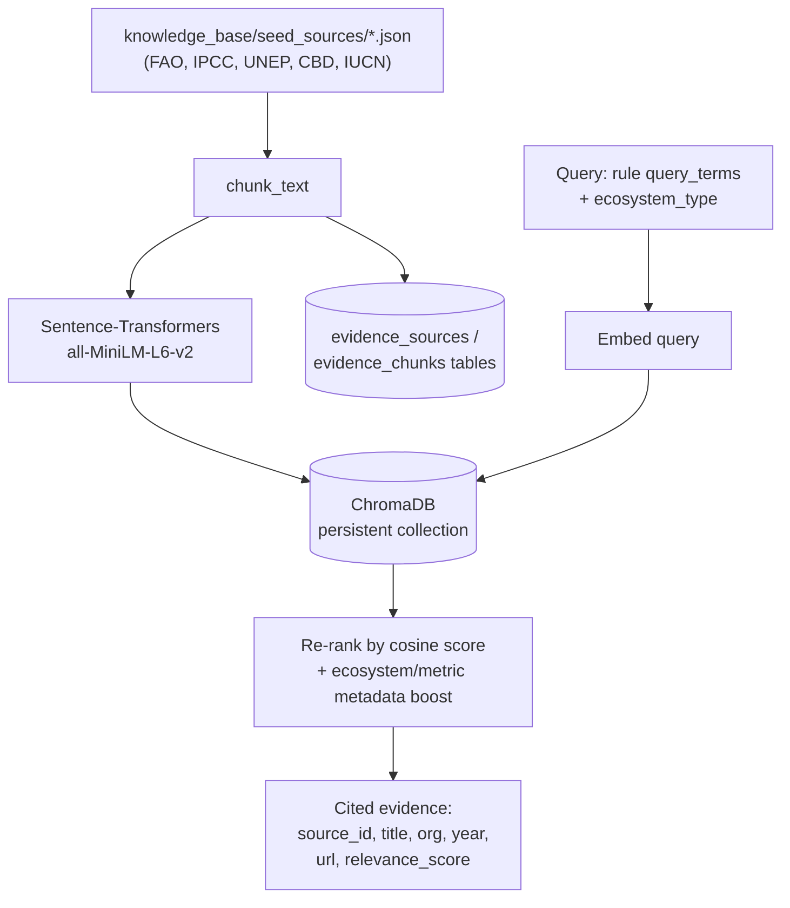
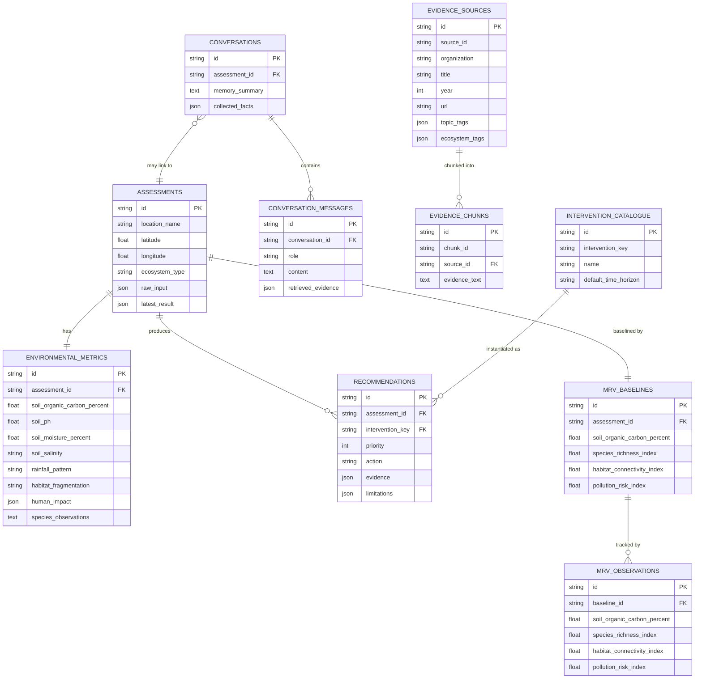

# EcoRestore Intelligence

**Evidence-Grounded AI for Biodiversity Recovery and Environmental MRV**

Built for the **Darukaa.Earth AI Biodiversity Intelligence Chatbot Challenge**.

EcoRestore Intelligence is an AI environmental-scientist assistant. It accepts free text
*and* structured ecosystem data, combines multiple environmental variables through a
deterministic multi-metric reasoning engine, retrieves credible evidence from a curated
knowledge base via RAG, and produces a ranked, cited biodiversity-restoration plan — with
confidence scoring, explicit limitations, and baseline/follow-up MRV tracking.

> This is deliberately **not** a generic LLM chatbot. The rule engine (not the LLM) decides
> *what* to recommend; the LLM (optional) only rephrases the already-computed reasoning and
> already-retrieved evidence into prose, and is never allowed to invent sources or numbers.

---

## 1. Project goal and challenge alignment

| Challenge requirement | Implementation |
|---|---|
| Text + structured JSON input | `Assessment` page (form + JSON tab) and `AI Scientist Chat` |
| Multi-turn conversation memory | `conversations` / `conversation_messages` tables, `collected_facts` merged across turns |
| Follow-up questions for missing data | `app/chat/clarification.py`, max 3 focused questions per turn |
| RAG-backed evidence retrieval | ChromaDB + `all-MiniLM-L6-v2` embeddings, `app/rag/` |
| Rule-based multi-metric reasoning | `app/reasoning/rules.py` — every rule requires ≥3 variables |
| Recommendations with evidence/metrics/time horizon/confidence/limitations | `AssessmentResponse` schema, enforced end-to-end |
| Baseline + follow-up MRV tracking | `mrv_baselines` / `mrv_observations`, MRV Tracker page |

## 2. Architecture



**Key design decision:** the reasoning pipeline is `structured variables → deterministic
rules → intervention aggregation → evidence retrieval → ranked, cited output`, with the LLM
step strictly additive at the end (see `app/reasoning/engine.py`). If `LLM_PROVIDER=none`
(the default) or the OpenAI call fails, template-composed text is used instead — the pipeline
never depends on a paid API key.

## 3. Knowledge ingestion / RAG flow



- `scripts/ingest_knowledge.py` chunks, embeds, and stores every seed source in both ChromaDB
  (semantic search) and the relational DB (`evidence_sources` / `evidence_chunks`, for joins
  and admin queries).
- The FastAPI app also auto-runs this ingestion on startup if the DB is empty
  (`app/main.py::on_startup`), so a fresh clone/deploy is immediately queryable.
- Every recommendation cites **only** sources actually returned by retrieval
  (`tests/test_citations.py` enforces this). If no evidence supports a numeric estimate, the
  API returns the literal sentence: *"A site-specific numerical estimate is not provided
  because the retrieved evidence does not establish one for these conditions."*

## 4. Multi-metric reasoning design

`app/reasoning/rules.py` implements deterministic predicates over structured ecosystem
variables — **not** LLM prompting. Every rule requires at least three connected variables,
for example:

- **R1** low soil organic carbon + monoculture land use + low/irregular rainfall →
  legume cover crops, agroforestry, rainwater harvesting.
- **R2** high habitat fragmentation + low species observations + human disturbance →
  habitat corridor restoration, pollinator strips.
- **R3** mangrove/coastal + high salinity + aquaculture expansion + low biodiversity →
  mangrove buffer restoration, pollution-control monitoring, corridor restoration.
- **R4** high rainfall + degraded vegetation cover + erosion risk (fragmentation/disturbance) →
  riparian buffer restoration, erosion control ground cover.
- **R5–R7** pesticide pressure, heat/moisture stress, and wetland fragmentation variants.

Activated rules are aggregated by intervention, ranked by (a) number of supporting rules and
(b) average retrieved-evidence relevance score, then enriched with evidence from RAG. Every
step (variables detected → risk signals → rules activated → evidence retrieved → ranking
rationale) is recorded verbatim in `reasoning_trace` and returned to the client — this is what
makes the system explainable rather than an opaque LLM answer.

Confidence is computed from: number of rules activated, number of missing critical fields, and
retrieved-evidence coverage/relevance — see `app/reasoning/engine.py::_confidence`.

## 5. Database schema



Note: ChromaDB stores the embedded evidence chunks for semantic search; `evidence_sources` /
`evidence_chunks` mirror the same records relationally so they can be joined, filtered, and
audited with SQL.

## 6. Local setup

**Prerequisites:** Python 3.11+, Node 20+.

```bash
# Backend
cd backend
python -m venv .venv
source .venv/bin/activate        # Windows: .venv\Scripts\activate
pip install -r requirements.txt
cp ../.env.example ../.env       # optional — defaults work with no .env at all
python ../scripts/ingest_knowledge.py   # embeds the knowledge base into ChromaDB
uvicorn app.main:app --reload --port 8000

# Frontend (separate terminal)
cd frontend
npm install
npm run dev
```

Visit `http://localhost:5173`. The backend defaults to SQLite and a deterministic (no-API-key)
LLM fallback, so nothing above requires any secret.

## 7. Docker setup

```bash
docker compose up --build
```

This starts PostgreSQL, the FastAPI backend (auto-ingesting the knowledge base into a
persisted Chroma volume on first boot), and the Vite-built frontend behind nginx.

- Frontend: http://localhost:5173
- Backend: http://localhost:8000 (docs at `/docs`)

## 8. Test commands

```bash
# Backend
cd backend
pytest -v

# Frontend
cd frontend
npm test          # vitest run
npm run build     # production build check
```

## 9. CI/CD

`.github/workflows/ci.yml` runs on every push and pull request:
1. Install backend dependencies → run `pytest`.
2. Install frontend dependencies → run `npm test`.
3. Run `npm run build` (production build) to catch type/build errors.

## 10. Deployment URLs

| Service | URL |
|---|---|
| Frontend (Vercel) | `<TO BE FILLED AFTER DEPLOYMENT>` |
| Backend (Render) | `<TO BE FILLED AFTER DEPLOYMENT>` |
| API docs | `<backend URL>/docs` |

See `docs/submission-notes.md` for exact deployment steps and environment variables.

## 11. Limitations and responsible-AI safeguards

- **No fabricated evidence.** Every citation is a source actually returned by the retrieval
  layer; `tests/test_citations.py` checks this programmatically. If no matching evidence
  exists, the recommendation says so explicitly rather than inventing a source.
- **No fabricated numbers.** The system never states a specific numeric improvement estimate
  (e.g. "+15% carbon") unless the retrieved evidence itself states one — which the current
  curated knowledge base intentionally does not, so every recommendation includes the explicit
  "no numeric estimate" disclosure required by the challenge brief.
- **Deterministic reasoning, not LLM guessing.** Which interventions are proposed is decided
  entirely by `app/reasoning/rules.py`; the LLM (when enabled) only rephrases already-computed
  output and is instructed never to contradict the reasoning trace.
- **Confidence reflects real uncertainty.** Confidence drops when critical fields are missing
  or retrieved evidence is weak/absent — it is not a fixed or cosmetic number.
- **MRV honesty.** The MRV tracker never claims improvement or decline unless an actual
  follow-up observation has been entered; a baseline alone is reported as "no comparison yet."
- **Not a substitute for field ecology.** Every recommendation explicitly states it is based
  on the submitted variables and retrieved evidence, not an on-site survey.
- **Knowledge base scope.** The seed knowledge base (`knowledge_base/seed_sources/`) is a
  small, curated set of paraphrased claims from FAO/IPCC/UNEP/CBD/IUCN public guidance,
  intended to demonstrate a genuine RAG pipeline for this challenge — it is not exhaustive,
  and source URLs point to the organizations' general topic pages rather than being presented
  as a formal citation index.

---

## Repository layout

```text
ecorestore-intelligence/
  frontend/     React + TS + Vite + Tailwind — 4 pages, Leaflet map
  backend/      FastAPI + SQLAlchemy + Pydantic + Alembic
  knowledge_base/
    seed_sources/     curated FAO/IPCC/UNEP/CBD/IUCN evidence records
    chroma_store/      persisted ChromaDB vector index (generated)
  docs/         demo script, submission notes
  scripts/      ingest_knowledge.py
  .github/workflows/  CI
  docker-compose.yml
```
